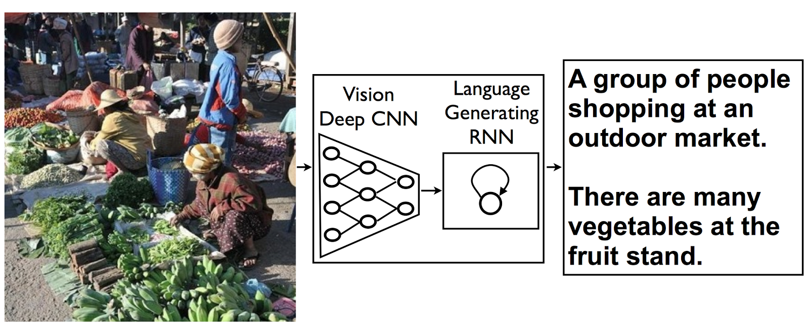
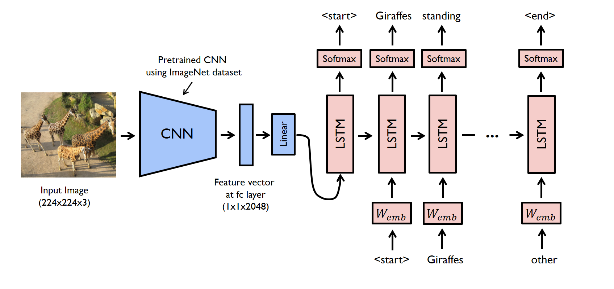

# LSML2 Final Project Image Captioning
**Author: Ivan Studenikin**

This application is an implementation of network described in <a href="https://ai.googleblog.com/2014/11/a-picture-is-worth-thousand-coherent.html">this article.</a>  

## How to run
1. Build docker using command:  
`docker build . -t image_captioning`  
2. Run application using command:  
`sudo docker run -p 5000:5000 -t -i image_captioning`  
3. Then you can open app in browser by link:  
`http://localhost:5000`

## Model characteristics
Model consists of CNN encoder and RNN decoder.  
Cross-enthropy loss was used as metric.  
I have trained my CaptionNet model during 20 epochs and achieved:  
$`Loss_{val} \approx 2.40;  \;\; Loss_{train} \approx 2.23`$

## Dataset
I used MSCOCO dataset with 118287 images, and five captions for every image to train model.

## Project structure
1. `week6_final_project.ipynb` - notebook with model training code.
2. `data/` - folder with train dataset.
3. `static/`, `templates/` - folders with app templates.
4. `network_result.bin` - saved model weigths
